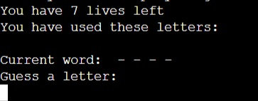
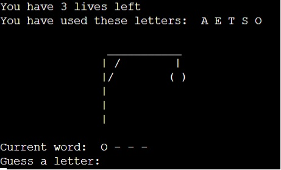
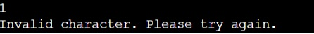

# HANGMAN
Hangman is a Python terminal game, which runs in the Code Institue mock terminal on Heroku.

Users try to guess the letters of the hidden word before they run out of lives. Each wrong guess takes away 1 life. 

[Here is the live version of my project.](https://hangman-ak.herokuapp.com/)

## User Experience

### User Stories
#### First Time Visitor Goals
a. As a first time visitor, I want to be able to start the game easily.

b. As a first time visitor, I want to be challenged by the game.

c. As a first time visitor, I want to be able to run the game again easily so i can keep playing.

#### Returning Visitor Goals
a. As a returning visitor, I want to continue to be challenged with a choice of dificulty level. 

b. As a returning visitor, I want to keep track of my score.

c. As a returning visitor, I want to be able to challenege other users. 

## Design 

* Command line game that has the hangman frame above the word that is hidden by '_'.

## How To Play

Hangman is a paper and pencil guessing game for two or more players. One player thinks of a word, phrase or sentence and the other(s) tries to guess it by suggesting letters within a certain number of guesses. You can read more about it on [Wikipedia](https://en.wikipedia.org/wiki/Hangman_(game))

In this version the player enters their name and then a random word is generated for the player to guess.

The player can see how many lives they have and are asked to guess a letter. After guessing a letter the letter will either appear in the word or take away a life in which case the frame of the hangman will be drawn. All letters guessed are shown below the lives. 

The player then keeps guessing until they either get the word or run out if lives.If the player gets the word you get a message of Congratulations. If the player does not get the word in the amount of lives the word will be revealed. Afer etiher event the player will be asked to play again which well then randomly generate a new word to play.

## Features

### Existing Features

#### Random Word Generator

* A random word is chosen from a list of chosen words in the words.py file.
* The word is then hidden from the player using _.

#### User Input

* Player input is registered either in the form of getting a letter correct or incorrect. 
* Getting an input correct will show a letter in the word.
* Getting an input incorrect will take a life away from the lives and start to draw out the hangman.

#### Input Validation/ Error Checking

* When the player enters anything other than a letter a error message will appear telling the player.
* When a player puts anything other than 1 letter in the same error message will appear.

### Future Features

* Add difficulty setting to change amount of lives player has.

* Add a scoring system.

* Implement a true random word generator rather than usings a set list.  

## Testing

### I have manually tested the project by doing the following:

* Tested python code through a PEP8 Linter using (http://pep8online.com/) and fixed any errors.

* Manually tested user inputs by purposefully inputing incorrect data to confirm error messages were capturing wrong inputs.

* Tested in the local terminal and on the mock terminal on the deployed site on Heroku.

### Technologies Used

#### Languages
* Python.

#### Libraries
* random to select a random word.

### Bugs 

#### Fixed Bugs 
* When writing out the hangman graphic, left white spaces in which messed up the look of it when printed in the terminal.
    * Deleted the white spaces and it fixed up the way hangman graphic looked. 

* word_list code was to long for one line. (line 55)
    * Split the line up over two lines to be within the correct length.

#### Unfixed bugs 
* No unfixed bugs. 

### Valiodators 
* PEP8 
    * No Errors returned from http://pep8online.com/

## Deployment

### The project was deployed using Code Institutes mock terminal for Heroku.

### Steps to deploy:
* Fork or clone this repository.
* requirements.txt can be left empty as this project does not use any external libraries.
* Create a new app in Heroku.
* Select "New" and "Create new app".
* Name the new app and click "Create new app".
* In "Settings" select "BuildPack" and select Python and Node.js.
* Whilst still in "Settings", click "Reveal Config Vars" and input the folloing. KEY: PORT, VALUE: 8000. Nothing else is needed here as this project does not have any sensitive files.
* Click on "Deploy" and select your deploy method and repository.
* Click "Connect" on selected repository.
* Either choose "Enable Automatic Deploys" or "Deploy Branch" in the manual deploy section.
* Heroku will now deploy the site.

## Credits 

* [Code Institute](https://codeinstitute.net/) for the mock terminal for the deploy to a live site.
* [Kite](https://www.youtube.com/watch?v=m4nEnsavl6w) inspiration on how to build a hangman game. I have also used the words list in the words.py file.
* [ASCII Art Generator](https://patorjk.com/software/taag/#p=display&f=Standard&t=Hangman) for creating word art for game title and game over screens.

### Thanks
* Narender Singh - Code Institute mentor who's advice and guidance supported me in the completion of this project
