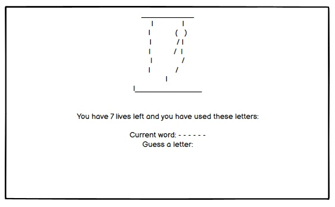

# User Experience

## User Stories
### First Time Visitor Goals
a. As a first time visitor, I want to be able to start the game easily.

b. As a first time visitor, I want to be challenged by the game.

c. As a first time visitor, I want to be able to run the game again easily so i can keep playing.

### Returning Visitor Goals
a. As a returning visitor, I want to continue to be challenged with a choice of dificulty level. 

b. As a returning visitor, I want to keep track of my score.

c. As a returning visitor, I want to be able to challenege other users. 

# Design 

* Command line game that has the hangman frame in the centre of the screen and the first game already loaded. 